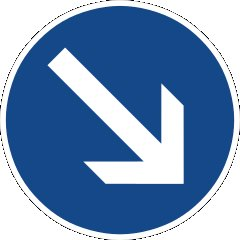

## Project: Build a Traffic Sign Recognition Program
[](http://www.udacity.com/drive)

Overview
---
In this project, you will use what you've learned about deep neural networks and convolutional neural networks to classify traffic signs. You will train and validate a model so it can classify traffic sign images using the [German Traffic Sign Dataset](http://benchmark.ini.rub.de/?section=gtsrb&subsection=dataset). After the model is trained, you will then try out your model on images of German traffic signs that you find on the web.

We have included an Ipython notebook that contains further instructions 
and starter code. Be sure to download the [Ipython notebook](https://github.com/udacity/CarND-Traffic-Sign-Classifier-Project/blob/master/Traffic_Sign_Classifier.ipynb). 

We also want you to create a detailed writeup of the project. Check out the [writeup template](https://github.com/udacity/CarND-Traffic-Sign-Classifier-Project/blob/master/writeup_template.md) for this project and use it as a starting point for creating your own writeup. The writeup can be either a markdown file or a pdf document.

To meet specifications, the project will require submitting three files: 
* the Ipython notebook with the code
* the code exported as an html file
* a writeup report either as a markdown or pdf file 

Creating a Great Writeup
---
A great writeup should include the [rubric points](https://review.udacity.com/#!/rubrics/481/view) as well as your description of how you addressed each point.  You should include a detailed description of the code used in each step (with line-number references and code snippets where necessary), and links to other supporting documents or external references.  You should include images in your writeup to demonstrate how your code works with examples.  

All that said, please be concise!  We're not looking for you to write a book here, just a brief description of how you passed each rubric point, and references to the relevant code :). 

You're not required to use markdown for your writeup.  If you use another method please just submit a pdf of your writeup.

The Project
---
The goals / steps of this project are the following:
* Load the data set
* Explore, summarize and visualize the data set
* Design, train and test a model architecture
* Use the model to make predictions on new images
* Analyze the softmax probabilities of the new images
* Summarize the results with a written report

### Dependencies
This lab requires:

* [CarND Term1 Starter Kit](https://github.com/udacity/CarND-Term1-Starter-Kit)

The lab environment can be created with CarND Term1 Starter Kit. Click [here](https://github.com/udacity/CarND-Term1-Starter-Kit/blob/master/README.md) for the details.

### Dataset and Repository

1. Download the data set. The classroom has a link to the data set in the "Project Instructions" content. This is a pickled dataset in which we've already resized the images to 32x32. It contains a training, validation and test set.
2. Clone the project, which contains the Ipython notebook and the writeup template.
```sh
git clone https://github.com/udacity/CarND-Traffic-Sign-Classifier-Project
cd CarND-Traffic-Sign-Classifier-Project
jupyter notebook Traffic_Sign_Classifier.ipynb
```
[image1]: ./writeup_pic/visualize_data.png "Visualization"
[image2]: ./writeup_pic/show_sample.png "Sample Data"
[image3]: ./newpic/1.jpg
[image4]: ./newpic/2.jpg
[image5]: ./newpic/3.jpg
[image6]: ./newpic/4.jpg
[image7]: ./newpic/5.jpg


## Writeup

###  Load the Data, Explore, summarize and visualize the data set
The first step of this project is loading and visualize the data to understand how was it built.

The size of training set is: 34799
The size of the validation set is: 4410
The size of test set is: 12630
The shape of a traffic sign image is: (32,32,3)
The number of unique classes is: 43

After that, I visualize the data set:

![alt text][image1]

And showing some data sample, then normalize the training data. I choose to do a quick way for it, by divide all data to 255, then shuffle it.

![alt text][image2]

There are still so many way to playing with this data set, like usng Gaussian Blur to reduce image noise, or to optains a smooth grayscale image, or to increase the number of images in training data set.

### Design, train and test a model architecture
My model has the following structure:

| Layer         		|     Description	        					|
|:---------------------:|:---------------------------------------------:|
| Input         		| 32x32x3 RGB image (normalized)				|
| Convolution 1     	| 1x1 stride, VALID padding, output = 26x26x8 	|
| RELU			|												|
| Max pooling	      	| 2x2 stride, VALID padding, output = 13x13x8   |
| Convolution 2  	    | 1x1 stride, VALID padding, output = 8x8x22    |
| RELU					|												|
| Max pooling	      	| 2x2 stride, VALID padding, output = 4x4x22    |
| Flatten				| output = 352									|
| Fully connected		| input = 352, output = 150       	            |
| RELU					|												|
| Fully connected		| input = 150, output = 84       	            |
| RELU					|												|
| Fully connected		| input = 84, output = 43       	            |

This model was modified from LeNet model. The last output layer has 43 nodes, for 43 sign classes. I have trained this model on my CPU, with 20 epoch it reaches 93.6% accuracy on validation set, 92.3% on test set, and it takes 30min. of training.

Adam Optimizer (tf.train.AdamOptimizer()) was applied in training process. 

### Use the model to make predictions on new images, analyze the softmax probabilities of the new images
I downloaded 5 new images in wikipedia in this link:
https://en.wikipedia.org/wiki/Road_signs_in_Germany
<br>


And label them manually, test them with my model and have 80% accuracy. For a small sample, 80% is a good one.

The sofrmax probabilities of the new images was also calculated in jupyter notebook file.

